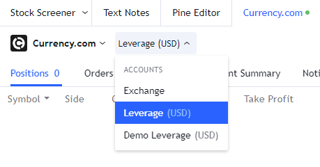

.. links
.. _`/accounts`: https://www.tradingview.com/rest-api-spec/#operation/getAccounts
.. _`/authorize`: https://www.tradingview.com/rest-api-spec/#operation/authorize
.. _`/config`: https://www.tradingview.com/rest-api-spec/#operation/getConfiguration
.. _`/depth`: https://www.tradingview.com/rest-api-spec/#operation/getDepth
.. _`/groups`: https://www.tradingview.com/rest-api-spec/#operation/getGroups
.. _`/history`: https://www.tradingview.com/rest-api-spec/#operation/getHistory
.. _`/instruments`: https://www.tradingview.com/rest-api-spec/#operation/getInstruments
.. _`/logout`: https://www.tradingview.com/rest-api-spec/#operation/logout
.. _`/mapping`: https://www.tradingview.com/rest-api-spec/#operation/getMappin
.. _`/orders`: https://www.tradingview.com/rest-api-spec/#operation/placeOrder
.. _`/ordersHistory`: https://www.tradingview.com/rest-api-spec/#operation/getOrdersHistory
.. _`/permissions`: https://www.tradingview.com/rest-api-spec/#operation/getPermissions
.. _`/positions`: https://www.tradingview.com/rest-api-spec/#operation/getPositions
.. _`/quotes`: https://www.tradingview.com/rest-api-spec/#operation/getQuotes
.. _`/state`: https://www.tradingview.com/rest-api-spec/#operation/getState
.. _`/streaming`: https://www.tradingview.com/rest-api-spec/#operation/streaming
.. _`/symbol_info`: https://www.tradingview.com/rest-api-spec/#operation/getSymbolInfo
.. _`PasswordBearer`: https://www.tradingview.com/rest-api-spec/#section/Authentication/PasswordBearer
.. _`OAuth2Bearer`: https://www.tradingview.com/rest-api-spec/#section/Authentication/OAuth2Bearer
.. _`ServerOAuth2Bearer`: https://www.tradingview.com/rest-api-spec/#section/Authentication/ServerOAuth2Bearer
.. _`OpenID Connect`: https://openid.net/specs/openid-connect-core-1_0.html#AuthRequest

FAQ
***

🎾 What about error handling when an error occurs? Should we respond with error code 400 (Bad Request) or 200 (OK)?
   If the request causes an error on your side, you should return *ErrorResponse* with next values:

   * status --- ``200``,
   * ``s`` --- ``error``,
   * ``errmsg`` --- a user-friendly description of the error, which we'll show to the user in the notification.

Authentication
--------------

Are there any restrictions on the lifetime of tokens? What is the optimal lifetime?
   Max lifetime is a 32-bit signed integer —-- ``2147483647``. It’s about 24.8 of a day. Furthermore, you can make it
   never-ending if you don’t send ``expired_in`` parameter, but we think this is unsafe. The optimal token lifetime
   should be in the range of 15-30 minutes.

🎾 There is no ``prompt`` parameter in the OAuth specification? How is it used?
   We use this parameter for :ref:`OAuth2 Implicit flow<oauth2-implicit-flow>`. The ``prompt`` is absent in the 
   :rfc:`6749`, but it is using in the `OpenID Connect`_ specification. This parameter is a flag for prompting for user
   credentials. Everything should be simple on your side.

   * When you receive ``prompt: login`` in the authorization request, ask the user for credentials. If successful,
     redirect the user (with an access token) to our ``redirect url``.
   * If you receive a request for authorization with ``prompt: none``, then immediately redirect with the token.

🎾 Will the ``scope`` parameter be sent on authorization? What about its values? How do we deal with them?
   This parameter is optional. We don’t process it on our side, but wait for its value from the broker. 
   Following :rfc:`6749#section-3.3` the value of the parameter is expressed as a list of space-delimited,
   case-sensitive strings. We will send a ``scope`` in the request upon authorization, but not when refreshing a token.

::

      {
         //...
         "scope": "read trade marketdata stream",
         //...
      }

Do we have to implement all 4 authorization flows?
   Integration is divided into 2 parts: data integration and trading integration. Data Integration supports
   `PasswordBearer`_, `ServerOAuth2Bearer`_ authorization types. Integration of the trading part supports 
   `PasswordBearer`_, `OAuth2Bearer`_ (Implicit Flow), `OAuth2Bearer`_ (Code Flow) authorization types.
   The types of authorization for each part of the integration (data and trading) may differ.

🎾 Is the data integration API being requested by the user`s browser or by TradingView server?
   Data integration API is requested only by TradingView servers. Authorization functionality is optional.
   You can implement the `/authorize`_ if your data is not public.

Can you talk more about the `PasswordBearer`_ authorization flow?
   In general, the flow is the following:

   1. The user selects a broker in the Trading Panel at the TradingView website.
   2. A popup for entering broker credentials is opened for the user.
   3. The user enters broker\'s credentials and presses the “Connect” button (submits the form).
   4. Your REST server receives a POST request to `/authorize`_ endpoint with credentials in it.
   5. Your REST server validates the credentials and, if successful, gives a response with a token.
   6. Then you get this token in all other requests to your REST server in the ``Authorization`` header.

Can we use the same Client ID in both staging and production environments?
   The Сlient IDs for each of the 6 environments connections must be unique, this is a requirement of our security team.
   The TradingView website in the sandbox or production can be connected to only 1 broker's environment at a time. 

Are you able to support the OAuth2 Client Credentials Grant for authorizing to our server? 
   Our client uses OAuth 2.0 JWT Bearer Flow. Please check out `ServerOAuth2Bearer`_ section in our specs. We need
   X.509 cert to sign the JWT. Our client forms the JWT, signs it and sends it in the body of the POST request as
   assertion field and expects to get a token in response.

Authorization
-------------

.. Authorize
.. .........

.. Logout
.. ......

Should we implement `/logout`_ endpoints for Implicit Flow?
   Implementation of `/logout`_ is optional. Use it if you need to know when a user is logging out of his session.

Broker Configuration
--------------------

.. Configuration
.. .............

What about the ``locale`` parameter in Configuration, do we need to support all the languages?
   With this parameter we provide information about locale used by the user accessing the integration. You can use this
   information to create a more comfortable UX for the user.

How can I modify the columns in the “Positions panel”?
   To get this done, you can use the ``positionCustomFields`` in the `/config`_ endpoint. If you want to use different
   custom columns for different accounts, use the ``positionCustomFields`` of the `/accounts`_ endpoint.

.. Mapping
.. .......

How can I map Forex symbols?
   You cannot map your Forex to any other exchange. The prices are different. If you want to support Forex, you need to
   connect your Forex data feed to TradingView using `/symbol_info`_, `/history`_, `/streaming`_ endpoints. You don\’t
   need to provide `/mapping`_ for Forex, so you don’t need to implement it in this case. `/mapping`_ is used for the
   exchange based instruments.

Account
-------

Can a user login multiple times simultaneously (login with the same account from two browsers for example)?
   That’s possible. Usually brokers limit number of concurrent session. For example, user can be connected from the
   desktop and mobile at the same time.

.. Accounts
.. ........

🎾 Where can a user see the type of account ("live" or "demo")?
   The account type can be specified in the ``type`` parameter in the `/accounts`_ endpoint. A user can see this 
   information when selecting an account in the extra menu.

.. How to implement orders (positions) with brackets?
..    :ref:`Brackets<section-concepts-brackets>` are Stop-Loss and Take-Profit orders. To place orders with brackets, set
..    flags ``supportOrderBrackets``, ``supportMarketBrackets``, ``supportPositionBrackets`` to ``true`` in the
..    `/accounts`_ ``d`` → ``config``.
   
..    After setting the ``supportOrderBrackets`` flag to ``true``, Stop-Loss and Take-Profit section will automatically
..    appear in the :ref:`Order Ticket<section-uielements-orderticket>`. If you send brackets to `/orders`_ with the
..    suitable ``type`` and ``status`` values, they will automatically appear in 
..    :ref:`Positions<section-concepts-positions>`. The value of the ``parentId`` field should be equal order's or
..    position's id to which they are attached.

.. Instruments
.. ...........

Should ``pipValue`` be returned in the `/instruments`_ in the instrument's currency or customer account currency?
   You should send it in the currency of the customer's account.

.. State
.. .....

.. We have two assets in trading account which is BTC and USDT. So for the `/state`_, what is the value of ``balance`` that we are supposed to return in this case?
..    You can fully customize both the *Account Summary Row* and the *Account Summary Tab* and display the information you
..    deem necessary there.

🎾 How often quotes and orders should be updated?
   The request intervals are defined in the `/config`_ in the ``pullingInterval`` object:

   * Default 500 mx and maximum 1000 ms for ``quotes``, and ``orders``.
   * Default 500 mx and maximum 1500 ms for ``positions``, ``accountManager``, and ``balances``.

.. Orders
.. ......

🎾 When user have several accounts, how to define the ``accountId`` for the oders?
   We get the ``accountId`` in the `/accounts`_ and then send your ``id`` of the account selected by the user (active
   account) in the request.

How can we map extra parameters required for order Placement in the order Custom fields. How can we map that in `/config`_ endpoint?
   This can be done via ``orderDialogCustomFields`` object at the account level (`/accounts`_ → ``ui``) or at the
   instrument level (`/instruments`_ → ``ui``), with the latter taking precedence.

.. Positions
.. .........

How does TradingView receive information about the events of the broker’s trading platform?
   We expect that all closed positions also will be sent to the `/positions`_ during the trading session.

   The same applies to executed orders. If we get an order with ``filled`` status in the /orders, then we show the user
   a message.

.. Balances
.. ........

.. Executions
.. ..........

.. Orders History
.. ..............

What is the difference between *Filled*, *Cancelled* and *Rejected* statuses in Orders tab and in History tab. Are these only available for a single login session in the Orders tab? Or should they always be the same as History? Wouldn't this be duplication of data in such case?
   The orders statuses can be divided into two groups in our API:
   
   * transitional (``placing``, ``inactive``, ``working``),
   * final (``rejected``, ``filled``, ``canceled``).
   
   Check :ref:`Orders<section-concepts-orders>` section for details.

.. Get Leverage
.. ............

.. Set Leverage
.. ............

.. Preview Leverage
.. ................

.. Trading
.. -------

.. Place Order
.. ...........

.. Modify Order
.. ............

.. Cancel Order
.. ............

.. Preview Order
.. .............

.. Modify Position
.. ...............

.. Close Position
.. ..............

Market Data
-----------

.. Quotes
.. ......

Is the `/quotes`_ endpoint required? Or do you have your own sources of quotes for securites?
   This method is optional, but highly required. It is needed to display your quotes directly in the 
   :ref:`Order Ticket<section-uielements-orderticket>`. This will reduce the chance of order execution at prices other
   than what the user sees.

Are requests for quotes coming from the client or from the server?
   Requests to the `/quotes`_ going from the client, requests to the `/streaming`_ going from the server. The broker
   should stream quotes to the `/streaming`_ for the server and simultaneously send them separately to each client in
   the response to the `/quotes`_ requests.

.. Depth
.. .....

How would we translate our logic into the `/depth`_ endpoint. And what will be the outcome in the UI panel?
   Each price corresponds to the number (volume) of open buy and sell orders. This presentation of information
   corresponds to how the :term:`DOM` usually works.

Data Permissions
----------------

.. Groups
.. ......

Should we implement `/permissions`_ if we return the same set of instruments for all users?
   The `/permissions`_ endpoint specifies which groups are available for the certain user. It is only required if you
   use groups of symbols to restrict access to instrument’s data.

.. Permissions
.. ...........

What if a user may have a different set of instruments for different accounts, because there is no such parameter as account id in the `/permissions`?
   Different sets of instruments for different accounts can be implemented via `/instruments`_. The permission mechanism
   serves somewhat differently, for example, to restrict access to paid data.

We sell data subscriptions. How can we inform that real-time data is available to the user?
   A broker should implement the `/permissions`_ endpoint. Otherwise we will show :term:`BATS` data for these exchanges
   if the user didn’t buy a subscription from us.

   When user logs into the integration, we send requests to the `/permissions`_ for determing a list of the
   subscriptions. We will show free BATS or delayed market data for users without real-time data subscriptions.
