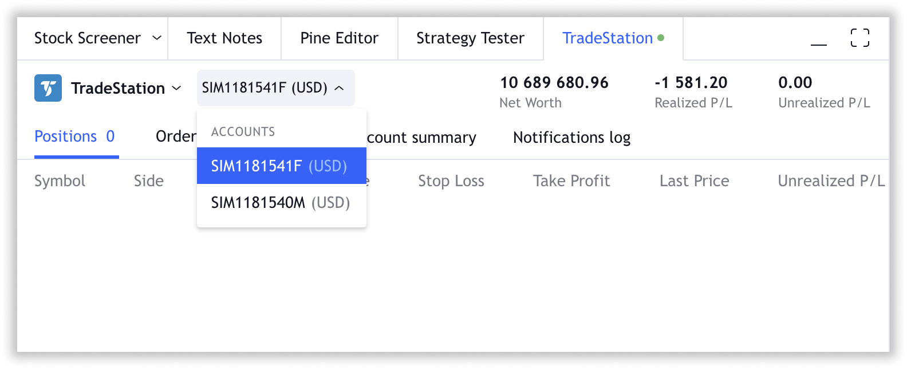

.. links
.. _`/accounts`: https://www.tradingview.com/rest-api-spec/#operation/getAccounts
.. _`/authorize`: https://www.tradingview.com/rest-api-spec/#operation/authorize
.. _`/config`: https://www.tradingview.com/rest-api-spec/#operation/getConfiguration
.. _`/depth`: https://www.tradingview.com/rest-api-spec/#operation/getDepth
.. _`/groups`: https://www.tradingview.com/rest-api-spec/#operation/getGroups
.. _`/history`: https://www.tradingview.com/rest-api-spec/#operation/getHistory
.. _`/instruments`: https://www.tradingview.com/rest-api-spec/#operation/getInstruments
.. _`/logout`: https://www.tradingview.com/rest-api-spec/#operation/logout
.. _`/mapping`: https://www.tradingview.com/rest-api-spec/#operation/getMappin
.. _`/orders`: https://www.tradingview.com/rest-api-spec/#operation/placeOrder
.. _`/ordersHistory`: https://www.tradingview.com/rest-api-spec/#operation/getOrdersHistory
.. _`/permissions`: https://www.tradingview.com/rest-api-spec/#operation/getPermissions
.. _`/positions`: https://www.tradingview.com/rest-api-spec/#operation/getPositions
.. _`/quotes`: https://www.tradingview.com/rest-api-spec/#operation/getQuotes
.. _`/state`: https://www.tradingview.com/rest-api-spec/#operation/getState
.. _`/streaming`: https://www.tradingview.com/rest-api-spec/#operation/streaming
.. _`/symbol_info`: https://www.tradingview.com/rest-api-spec/#operation/getSymbolInfo
.. _`PasswordBearer`: https://www.tradingview.com/rest-api-spec/#section/Authentication/PasswordBearer
.. _`OAuth2Bearer`: https://www.tradingview.com/rest-api-spec/#section/Authentication/OAuth2Bearer
.. _`ServerOAuth2Bearer`: https://www.tradingview.com/rest-api-spec/#section/Authentication/ServerOAuth2Bearer
.. _`authentication`: https://www.tradingview.com/rest-api-spec/#section/Authentication
.. _`OpenID Connect`: https://openid.net/specs/openid-connect-core-1_0.html#AuthRequest
.. _`streamingHistoryEquality`: https://github.com/tradingview-inspect/tests/wiki/streamingHistoryEquality
.. _`Place Order`: https://www.tradingview.com/rest-api-spec/#operation/placeOrder
.. _`JWT Bearer Flow example`: https://help.salesforce.com/s/articleView?id=sf.remoteaccess_oauth_jwt_flow.htm&type=5

FAQ
***

What about error handling when an error occurs? Should we respond with error code 400 (Bad Request) or 200 (OK)?
   If the request causes an error on your side, you should return *ErrorResponse* with next values:

   * status --- ``200``,
   * ``s`` --- ``error``,
   * ``errmsg`` --- a user-friendly description of the error, which we'll show to the user in the notification.

Authentication
--------------

Are there any restrictions on the lifetime of tokens? What is the optimal lifetime?
   Max lifetime is a 32-bit signed integer --- ``2147483647`` ms. It\'s about 24.8 of a day. Furthermore, you can make
   it never-ending if you don\'t send ``expired_in`` parameter, but we think this is unsafe. The optimal token lifetime
   should be in the range of 15-30 minutes.

There is no ``prompt`` parameter in the OAuth specification? How is it used?
   We :ref:`use <oauth2-implicit-flow-refresh-token>` this parameter for 
   :ref:`OAuth2 Implicit flow<oauth2-implicit-flow>`. The ``prompt`` is absent in the :rfc:`6749`, but it is using in 
   the `OpenID Connect`_ specification. This parameter is a flag for prompting for user credentials. Everything should 
   be simple on your side.

   * When you receive ``prompt: login`` in the authorization request, ask the user for credentials. If successful,
     redirect the user (with an access token) to our ``redirect url``.
   * If you receive a request for authorization with ``prompt: none``, then immediately redirect with the token.

Will the ``scope`` parameter be sent on authorization? What about its values? How do we deal with them?
   :ref:`This parameter <oauth2-implicit-flow-authorization>` is optional. We don\'t process it on our side, but wait for
   its value from the broker. Following :rfc:`6749#section-3.3` the value of the parameter is expressed as a list of 
   space-delimited, case-sensitive strings. We will send a ``scope`` in the request upon authorization, but not when 
   refreshing a token.

.. code-block:: json

  {
    "scope": "read trade marketdata stream",
  }

Do we have to implement all 4 authentication flows?
   Integration is divided into 2 parts: data integration and trading integration. Data Integration supports
   `PasswordBearer`_, `ServerOAuth2Bearer`_ authentication types. Integration of the trading part supports 
   `PasswordBearer`_, `OAuth2Bearer`_ (Implicit Flow), `OAuth2Bearer`_ (Code Flow) authentication types.
   The types of authentication for each part of the integration (data and trading) may differ.

Is the data integration API being requested by the user\'s browser or by TradingView server?
   Data integration API is requested only by TradingView servers. Authorization functionality is optional. You can 
   implement the `/authorize`_ if your data is not public.

Can you talk more about the `PasswordBearer`_ authorization flow?
   In general, the :ref:`flow <password-bearer-flow>` is the following:

   1. The user selects a broker in the Trading Panel at the TradingView website.
   2. A popup for entering broker credentials is opened for the user.
   3. The user enters broker\'s credentials and presses the Connect button (submits the form).
   4. Your REST server receives a POST request to `/authorize`_ endpoint with credentials in it.
   5. Your REST server validates the credentials and, if successful, gives a response with a token.
   6. Then you get this token in all other requests to your REST server in the ``Authorization`` header.

.. _faq-unique-client-secrets:

Can we use the same Client ID in both staging and production environments?
   The ``client_id`` and ``client_secret`` for each of the :ref:`six environments connections <trading-environments>` 
   must be unique, this is a requirement of our security team. The TradingView website in the sandbox or production 
   can be connected to only one broker's environment at a time. 

Are you able to support the OAuth2 Client Credentials Grant for authorizing to our server? 
   Our client uses OAuth 2.0 JWT Bearer Flow. Please check out `ServerOAuth2Bearer`_ section in our specs. We need
   X.509 cert to sign the JWT. Our client forms the JWT, signs it and sends it in the body of the POST request as
   ``assertion`` field and expects to get a token in response.

Should a broker provide X.509 certificate or private key to sign the JWT?
   Data feed currently supports the JWT assertion workflow. We need X.509 certificate to sign the JWT. Our client forms
   a JWT, signs it, sends it in the POST request body as ``assertion`` field, and expects to recieve a token in
   response. See `JWT Bearer Flow example`_ for details.

Authorization
-------------

.. Authorize
.. .........

.. Logout
.. ......

Should we implement `/logout`_ endpoints for :ref:`Implicit flow<oauth2-implicit-flow>`?
   Implementation of `/logout`_ is optional. Use it if you need to know when a user is logging out of his session.

Broker Configuration
--------------------

.. Configuration
.. .............

What about the ``locale`` parameter in Configuration, do we need to support all the languages?
   With this parameter we provide information about locale used by the user accessing the integration. You can use this
   information to create a more comfortable UX for the user.

How can I modify the columns in the Positions panel?
   To get this done, you can use the ``positionCustomFields`` in the `/config`_ endpoint. If you want to use different
   custom columns for different accounts, use the ``positionCustomFields`` of the `/accounts`_ endpoint.

.. Mapping
.. .......

How can I map Forex symbols?
   You cannot :doc:`map <trading/Mapping_symbols>` your Forex to any other exchange. The prices are different. If you 
   want to support Forex, you need to connect your Forex data feed to TradingView using `/symbol_info`_, `/history`_, 
   `/streaming`_ endpoints. You don\'t need to provide `/mapping`_ for Forex, so you don\'t need to implement it in this
   case. `/mapping`_ is used for the exchange based instruments.

Account
-------

Can a user login multiple times simultaneously (login with the same account from two browsers for example)?
   That\'s possible. Usually brokers limit number of concurrent session. For example, user can be connected from the
   desktop and mobile at the same time.

.. Accounts
.. ........

Where can a user see the type of account (*live* or *demo*)?
   The account type can be specified in the ``type`` parameter in the `/accounts`_ endpoint. A user can see this 
   information when selecting an account in the extra menu. We expect that recieved ID is unique on the broker side.

When user has several accounts, how to define the ``accountId`` for the oders?
   We get the ``accountId`` in the `/accounts`_ and then send this ``id`` of the account selected by the user (active 
   account) in the request.

.. Instruments
.. ...........

Should ``pipValue`` be returned in the `/instruments`_ in the instrument's currency or customer account currency?
   You should :ref:`send <trading-concepts-pipvalue>` it in the currency of the customer's account.

.. State
.. .....

How often quotes and orders should be updated?
   The request intervals are defined in the `/config`_ in the ``pullingInterval`` object:

   * Default 500 ms and maximum 1000 ms for ``quotes``, and ``orders``.
   * Default 500 ms and maximum 1500 ms for ``positions``, ``accountManager``, and ``balances``.

Is the ``balance`` in the `/state`_ an account balance calculated at the average ask price of the instruments included in it?
   The balance line displays the number of funds available in the user's account. The riks calculation during trading 
   order filling goes through ``equity`` calculated as ``balance + unrealizedPl``.

If we dont' fill ``unrealizedPl``, how will the market price will be calculated on the TradingView side?
   The ``unrealizedPl`` field is required. It shouldn't be ignored. In fact, it is an indicator of the current 
   profit/loss from all open positions.

.. Orders
.. ......

How can we map extra parameters required for order *Placement* in the order *Custom fields*. How can we map that in `/config`_ endpoint?
   This can be done via ``orderDialogCustomFields`` object at the account level (`/accounts`_ --- ``ui``) or at the
   instrument level (`/instruments`_ --- ``ui``), with the latter taking precedence.

.. Positions
.. .........

How does TradingView receive information about the events of the broker\'s trading platform?
   We expect that all closed positions also will be sent to the `/positions`_ during the trading session.

   The same applies to executed orders. If we get an order with ``filled`` status in the `/orders`_, then we show the
   user a message.

.. Balances
.. ........

.. Executions
.. ..........

.. Orders History
.. ..............

What is the difference between *Filled*, *Cancelled* and *Rejected* statuses in *Orders* tab and in *History* tab. Are these only available for a single login session in the Orders tab? Or should they always be the same as History? Wouldn't this be duplication of data in such case?
   The orders statuses can be divided into two groups in our API:
   
   * transitional (``placing``, ``inactive``, ``working``),
   * final (``rejected``, ``filled``, ``canceled``).
   
   Check :ref:`Orders<trading-concepts-orders>` section for details.

.. Get Leverage
.. ............

.. Set Leverage
.. ............

.. Preview Leverage
.. ................

Trading
-------

.. Place Order
.. ...........

Should we ignore `Place Order`_ ``currentAsk``/``currentBid`` parameters for the market order?
   If it is Forex trading, these fields are required. In other cases, these parametes are still required to be send, but 
   remain unprocessed.

.. Modify Order
.. ............

.. Cancel Order
.. ............

.. Preview Order
.. .............

.. Modify Position
.. ...............

.. Close Position
.. ..............

Market Data
-----------

.. Quotes
.. ......

Is the `/quotes`_ endpoint required? Or do you have your own sources of quotes for securites?
   This method is optional, but highly required. It is needed to display your quotes directly in the 
   :ref:`Order Ticket<trading-ui-orderticket>`. This will reduce the chance of order execution at prices other
   than what the user sees.

Are requests for quotes coming from the client or from the server?
   Requests to the `/quotes`_ going from the client, requests to the `/streaming`_ going from the server. The broker
   should stream quotes to the `/streaming`_ for the server and simultaneously send them separately to each client in
   the response to the `/quotes`_ requests.

.. Depth
.. .....

We have an *Order Book* on our platfom. How would we translate our logic into the `/depth`_ endpoint.
   The `/depth`_ endpoint implementation is required for using :ref:`DOM <depth-of-market>` in our UI. Users get access 
   to :term:`DOM` only if the broker provides :term:`Level 2 data`. You should set ``supportLevel2Data`` and 
   ``supportDOM`` in the `/accounts`_ to ``true``, then implement `/depth`_.

Data Permissions
----------------

.. Groups
.. ......

.. Permissions
.. ...........

Should we implement `/permissions`_ if we return the same set of instruments for all users?
   The `/permissions`_ endpoint specifies which groups are available for the certain user. It is only required if you
   use groups of symbols to restrict access to instrument\'s data.

What if a user may have a different set of instruments for different accounts, because there is no such parameter as account id in the `/permissions`_?
   Different sets of instruments for different accounts can be implemented via `/instruments`_. The permission mechanism
   serves somewhat differently, for example, to restrict access to paid data.

We sell data subscriptions. How can we inform your server that real-time data is available to the user?
   A broker should implement the `/permissions`_ endpoint. When user logs into the integration, we send requests to the 
   `/permissions`_ for determing a list of the data subscriptions. If the user has data subscription on your side he 
   will not need to purchase one from TradingView.

Data Integration
----------------

.. Symbol Info
.. ...........

How does *Symbol* differs to *Tickers*?
   *Symbol* the name of the instrument that will be shown to users. *Ticker* the name of the instrument that our 
   data feed will use for server requests (for example ``/history?symbol= {ticker}``). Ticker is optional. If there is 
   no *Ticker* then we will use *Symbol* for requests.

If the broker is satisfied with TradingView instruments, can we not send anything to `/symbol_info`_ and not implement `/streaming`_ and `/history`_?
   That\'s right, the data integration is irrelevant when you are using only TradingView instruments.

How to set up session time for data integration?
   The session schedule is regulated in the `/symbol_info`_ with next paremeters: ``session-regular``, 
   ``session-premarket``, ``session-postmarket``, and ``session-extended``.

I added some new symbols but they aren't displayed on the chart. Do you call `/symbol_info`_ regularly or do you need to do it manually?
   We request `/symbol_info`_ every hour and automatically update it if everything is ok. But if we find some critical 
   changes or invalid values, manual verification will be required.

We want to show only our broker\'s symbols in the symbol search to our users. How to set it up?
   After login into the brokerage account, a user has enabled filter in the symbol search. So the user can see the 
   broker\'s symbols only. But this filter can be disabled. This behavior cannot be changed.

Following the `/symbol_info`_ specification, a symbol should contain uppercase letters, numbers, a dot or an underscore. But our exchange symbols contain the slash like ``BTC/USDT``. Is it allowed or we have to do a conversion to ``BTC_USDT``?
   You can add ticker field. We will use the ticker name for requests to API, it will be used prior to symbol filed. 
   Ticker has no strict requirements. symbol is what we show on the chart. so, you can have two fields:

.. code-block:: json

  "ticker": [
    "BTC/USDT",
    "ETH/USDT",
    "LTC/USDT"
  ],
  "symbol": [
    "BTCUSDT",
    "ETHUSDT",
    "LTCUSDT"
  ],

Does ``has-no-volume`` parameter indicate whether we can report trading volume of the symbol?
   If you can provide trading volume, just set ``has-no-volume: false`` in the `/symbol_info`_.

Our trading session opens at 17:00-16:00 CT. And we have pre-market at 16:50 CT. Should we report about pre-market within the main session?
   It depends on the bar building. We build bars using the ``session-regular`` value. For example, we build all the 
   resolutions (5 min, 1 hour, 4 hours etc.) for the session 17:00-16:00 from 17:00, even if ``session-premarket`` 
   value recieved.

How to use fileds ``bar-source``, ``bar-transform``, and ``bar-fillgaps`` to build bars?
   * If you build bars from trades, use ``bar-source: trade``. If you build from bids, use ``bar-source: bid``.
   * ``bar-transform`` is required when historical bars are aligned. It's needed for cases when open price is always
     equal to close price of the previous bar. If you don't have any alignments, just omit this field.
   * ``bar-fillgaps`` indicates the presence of degenerate bars in the absence of trades (bars with zero volume and
     equal :term:`OHLC` values).

Should we change the session schedule during the summer/winter time changes?
   You shouldn\'t change the session schedule without TradingView team's confirmation. The transition to summer/winter 
   time is carried out automatically following the ``timezone`` parameter in the `/symbol_info`_.

Should we change the session schedule during the holidays?
   You shouldn\'t change the session schedule without TradingView team's confirmation. We don\'t support holidays 
   parameter at the moment, but we'll add it in the future.

Is it possible to add breaks during the trading day?
   That's not possible right now, as the trading day is continuous.

Should we send ``StreamingDailyBarResponse``? Or it can be calculated from our 1-minute history intervals and live feed data?
   You do not need to send it. If there is ``has-daily: false`` in the `/symbol_info`_, we will skip the daily 
   updates. However, when it is impossible to build a daily bar from the 1-minute bars, we use daily bars from the API.

How to set up a minimal price step (min tick size)?
   Minimal tick size is set by ``pricescale`` and ``minmovement`` parameters in the `/symbol_info`_:
   ``min tick size =  minmovement / pricescale``. For example, if you need to set a price step in ``0.01``, then you
   need to set ``pricescale: 100``, and ``minmovement: 1``.

Are there any restrictions on the symbol groups number?
   Data integration is limited to 10 groups of symbols, no more than 10 thousand symbols each. One symbol can only 
   appear in one group.

.. History
.. .......

Is `/history`_ requested only for those instruments for which we supply our quotes?
   The `/history`_ is requested for all instruments represented in the symbol field of the `/symbol_info`_.

Which requests are going to the broker\'s server from the TradingView server and not from the client?
   Requests that are responsible for the data integration are sent from the TradingView server:  `/authorize`_, 
   `/groups`_, `/symbol_info`_, `/history`_, `/streaming`_.

Should we implement the ``countback`` parameter? It is marked as optional in the API.
   Your server should operate both requests: implement both parameters ``from`` and ``to``, as well as ``countback`` and
   ``to``. You can see the examples of such requests in the :doc:`History <../data/History>` section.

What time intervals you will send in the request to the `/history`_?
   We need 1-minute intervals only. However, we may need 1-day intervals in some cases. We are building interim 
   resolution on our side.

How often do you request `/history`_ to update your database?
   We send request to the `/history`_ once for the deep history filling. After that, we update the data twice a day. We 
   request `/history`_ if we didn\'t recive data from `/streaming`_ (as a result of provider\'s server side issues).

What is the expected timestamp precision for the query parameters ``from`` and ``to``?
   The timestamp should be specified in seconds.

Is it expected that the query to the `/history`_ should consider trades within the time interval, even for open and close prices?
   We build bar from the `/streaming`_ ticks. For verification, we use `streamingHistoryEquality`_ test.

.. Stream of prices
.. ................

How do you get prices from the brokers? The price can change more than ten times per second for each instrument.
   `/streaming`_ endpoint is a permanent connection used to accept changes in quotes for all instruments.

The symbol id is required for the stream of prices response. Can we use ticker format instead. i.e. return ``BTC/USDT`` instead of ``BTCUSDT``?
   Yes, it will be the correct response format for the `/streaming`_. 
