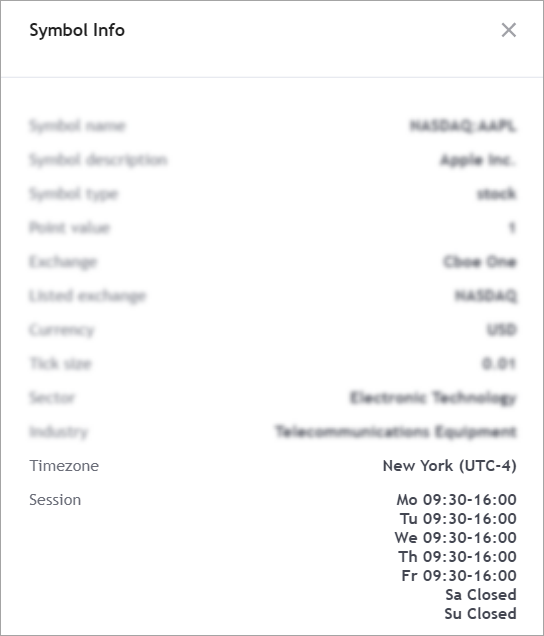

.. links
.. _`/symbol_info`: https://www.tradingview.com/rest-api-spec/#operation/getSymbolInfo

Session specification
---------------------

A session allows you to set a weekly trading schedule with an accuracy up to a specific day of the week.
Session information is displayed in the *Symbol Info* dialog.

How to set session boundaries
..............................

Session boundaries are specified by several parameters in the `/symbol_info`_.

+------------------------+----------------------------------------------------------------------------------------+
| Parameter              | Description                                                                            |
+========================+========================================================================================+
| ``session-regular``    | Time format: ``HHMM-HHMM`` (in the exchange time zone).                                |
|                        | For 24/7 traded symbols (for example, Crypto), the session string should be ``24x7``.  |
+------------------------+----------------------------------------------------------------------------------------+
| ``session-premarket``  | Additional session before ``session-regular``.                                         |
|                        | The end time is less or equal to the end of ``session-regular``.                       |
+------------------------+----------------------------------------------------------------------------------------+
| ``session-postmarket`` | Additional session after ``session-regular``.                                          |
|                        | The end time is greater or equal to the end of ``session-regular``.                    |
+------------------------+----------------------------------------------------------------------------------------+
| ``session-extended``   | Extended session including ``session-premarket`` and ``session-postmarket``.           |
|                        | The start time equal the start time of ``session-premarket``.                          |
|                        | The end time equal the end time of ``session-postmarket``.                             |
+------------------------+----------------------------------------------------------------------------------------+

.. note::
  Session time must be accurate to the minute, however, the last minute is not included in the session on the TradingView side.
  For example, if you specify that the session closes at ``23:59``, the last trade time included in TradingView will be ``23:58:59``.

Session breaks
~~~~~~~~~~~~~~~

Note that session breaks within one trading day are not supported for any instrument.
However, you can set `different sessions for different days <#different-sessions-for-different-days>`__.

If your platform supports session breaks within one trading day, you should combine sessions into one.
For example, if you have two sessions on the same day: 09:30−14:00 and 14:15−16:00, you should specify one session as `0930-1600`.

Different sessions for different days
~~~~~~~~~~~~~~~~~~~~~~~~~~~~~~~~~~~~~~

You can specify a session for a particular day by adding *:n* to a time range, where *n* is a day number.
The days of the weeks and the corresponding day numbers are related as follows: ``7`` is Saturday, ``1`` is Sunday, ``2`` is Monday, etc.
For example, ``0900-1700:23456|1000-1400:17`` means that all weekdays except Saturday and Sunday have one session that starts at 09:00 and ends at 17:00.
The Saturday and Sunday sessions start at 10:00 and end at 14:00.

.. note::
  The session schedule cannot overlap, otherwise, the validation error will occur.

How to use
...........

Here are some examples:

* Session 24/7, UTC time zone: first bar of the day opens at 00:00 UTC. The daily bar closes at 23:59 UTC every day,
  including Saturday and Sunday.
* Session ``0930-1600``, UTC time zone: bars open at 09:30 UTC, closing at 16:00 UTC every weekday.
* Session ``0930-1600``, New York time zone: bars open at 09:30 and close at 16:00 New York time every weekday.
* Session ``1800-1700``, London time zone: overnight session, interim bars to be cut from Sunday 18:00 London time.
* Session ``0900-1700:1|1000-1700:2|1100-1700:34567``, UTC time zone: Sunday sessions start at 09:00 UTC and end at 17:00 UTC, Monday sessions start at 10:00 UTC and end at 17:00 UTC. On other days, sessions start at 11:00 UTC and end at 17:00 UTC.

.. code-block:: json

  {
    "session-regular": [
      "0000-2359:23456",
      "0930-1600",
      "1700-1700"
    ],
    "session-extended": [
      "0000-2359:23456",
      "0400-2000",
      "1700-1700"
    ],
    "session-premarket": [
      null,
      "0400-0930",
      null
    ],
    "session-postmarket": [
      null,
      "1600-2000",
      null
    ]
  }
