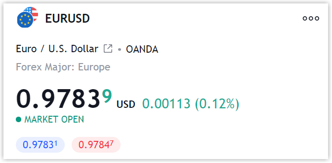

.. links
.. _`/symbol_info`: https://www.tradingview.com/rest-api-spec/#operation/getSymbolInfo

Symbol info
-----------

The `/symbol_info`_ endpoint returns a list of instruments and a set of rules for them. This endpoint is requested
every hour.

The response body (JSON) must include an ``s`` field. The response header must include the ``Content-Type`` 
header with the ``application/json`` value.

A ``symbol`` field is an array of strings. It is the name of the symbol that users will see. It must be unique. Symbol 
names are always displayed in uppercase. The symbol name is validated with a regex:

.. code-block:: none

  ^[A-Z0-9!&*+\-./\\_|=;]+$

With :ref:`division into symbol groups <groups-division>`, API must return symbols regardless of the parameters in the 
query to the `/symbol_info`_.

If the symbol groups exist, their names should have a prefix as broker\'s name. In this case, a request to the 
`/symbol_info`_ without groups parameter must return and error.

Symbol naming rules
......................

Here are the symbol naming rules for different instrument types on the TradingView\'s side.

Stocks
~~~~~~
``<Traded Exchange>:<Symbol>``

.. code-block:: cfg

	AAPL → NASDAQ:AAPL
	IBM → NYSE:IBM
	AAA → TSX:AAA
	ADW-B → TSX:ADW-B
	AAN → TSXV:AAN
	AFLT → MICEX:AFLT

.. note::
  CFDs require ``is-cfd`` flag set to ``true``

Stocks from the different exchanges under one prefix
~~~~~~~~~~~~~~~~~~~~~~~~~~~~~~~~~~~~~~~~~~~~~~~~~~~~
``<Traded Exchange>:<Exchange suffix>_<Symbol>``

.. code-block:: cfg

	CFD at NASDAQ:AAPL → EXCHANGENAME:NASDAQ_AAPL
	CFD at ASX:AAPL → EXCHANGENAME:ASX_AAPL
	
Forex
~~~~~
``<FX>:<Currency><Currency>``

.. code-block:: cfg

	EURUSD → FX:EURUSD
	USDEUR → FX:USDEUR
	
Futures
~~~~~~~~
``<Exchange>:<Root><2 Digit Day(optional)><Month Code><4 Digit Year>``

.. code-block:: cfg

	IMH2 → LIFFE:IMH2012
	MAH2 → EUIDX:MAH2012
	AVU2 → EUREX:AVU2012

If more than one contract is expired in one month, the expiration day is added to the name after the root.

.. code-block:: cfg

	BTCUSD → OKEX:BTCUSD24M2020
	ETHBTC → BITMEX:ETHBTC30U2020

.. note::
  Futures require ``root`` and ``root-description`` parameters

Crypto
~~~~~~
``<Exchange>:<Root><2 Digit Day(optional)><Month Code><4 Digit Year>``

.. code-block:: cfg

	BTCUSD → OKEX:BTCUSD // crypto pair
	BTCUSDT.P → OKEX:BTCUSDT.P // perpetual swap contract
	BTCUSDT25H2022 → BITMEX:BTCUSDT25H2022 // futures contract

Decentralized Exchanges (DEX)
~~~~~~~~~~~~~~~~~~~~~~~~~~~~~

Format: ``<Base currency>:<Currency>_<First 6 hash numbers of the pair>`` 
Format for pairs converted to USD or other fiat currency: ``<BASECURRENCY>:<CURRENCY>_<first 6 hash numbers of the pair>.USD``

Examples:

.. code-block:: cfg
	PANCAKESWAP:ETHUSD_74E471
	PANCAKESWAP:ETHUSD_74E471.USD

Leveraged Crypto ETFs
~~~~~~~~~~~~~~~~~~~~~~

Format: ``<Exchange>:<Symbol>.<Leverage size><Long or short direction>``

Examples:

.. code-block:: cfg
	MEXC:BTCUSDT.3L // BTC 3× Long 
	MEXC:BTCUSDT.3S // BTC 3× Short

Price display
......................

To manage how the price is displayed on the chart, use the following parameters in `/symbol_info`_.

-  ``minmovement`` indicates the number of units that make one price tick.
-  ``pricescale`` indicates how many decimal places a security price has.
-  ``minmovement2`` indicates the pip size for Forex prices or how to separate the main and additional fractions for fractional prices.

The parameter values depend on the price format chosen. 
There are two ways to display a security price:

-  The `decimal <#decimal-format>`__ format is used for most instruments, such as stocks, indices, and futures.
-  The `fractional <#fractional-format>`__ format is used only for futures traded on the CBOT (Chicago Board of Trade), 
   including futures on bulk commodities (grains, etc.) and US Federal Reserve Government bonds. 
   This format also has a variety — that is a fractional format of the fractional price.

Decimal format
~~~~~~~~~~~~~~

For the decimal format:

-  The ``minmovement`` value depends on the price tick chosen: 1, 5, etc.
-  The ``pricescale`` value must always be ``10^n``, where *n* is the number of decimal places. 
   For example, if the price has two decimal places ``300.01``, ``pricescale`` must be ``100``. 
   If it has three decimal places ``300.001``, ``pricescale`` must be ``1000``, etc. 
   If the price doesn't have decimals, ``pricescale`` must be ``1``.
-  The ``minmovement2`` value must always be ``0``, except for `Forex symbols <#forex-symbols>`__.

Forex symbols
^^^^^^^^^^^^^

Forex symbols have the decimal price format, however, the ``minmovement2`` value must differ from ``0``.
In this case, ``minmovement2`` indicates the pip size on the chart and the value must be ``10^n``, where ``n`` is the number of pips. 
A pip is the smallest whole unit measurement of the spread.
On the chart, the pip is displayed smaller than the price digits.

.. note::
	If ``minmovement2`` is ``0`` for Forex symbols, the spread is displayed in ticks, not pips.

Fractional format
~~~~~~~~~~~~~~~~~

The price in the fractional format is displayed as ``76'27``.
A single quote is used as a delimiter.

For the fractional format:

-  The ``minmovement`` value depends on the price tick chosen: 1, 5, etc.
-  The ``pricescale`` value must always be ``2^n``.
   It indicates the number of fractions.
   For example, if ``minmovement: 1`` and ``pricescale: 32``, the fraction numerator values can vary from 0 to 31.
-  The ``minmovement2`` value must always be ``0``, except for the fraction of fractional format.

Fractional format of the fractional price
^^^^^^^^^^^^^^^^^^^^^^^^^^^^^^^^^^^^^^^^^^

The fractional format of the fractional price is a particular case of the fractional price format. 
In this case, ``minmovement2`` indicates the part of the fraction and can differ from ``0``.

For example, for the ``76'27'2`` price: 76 is an integral part of the price, 27 is a fractional part of the price,
and 2 is a fractional part of the first fractional part (27).
To display such a price, you can specify the parameters in the following way: ``minmovement: 1``, ``pricescale: 128``, and ``minmovement2: 4``.

Tick size
...........

Tick size (minimum price step) is the minimum price amount a security can move in exchange. 
The tick size is calculated as ``minmovement``/ ``pricescale``.
For example, if you need a price step to be ``0.25``:

-  Set ``minmovement: 25`` and ``pricescale: 100`` for the decimal format.
-  Set ``minmovement: 1`` and ``pricescale: 4`` for the fractional format.
