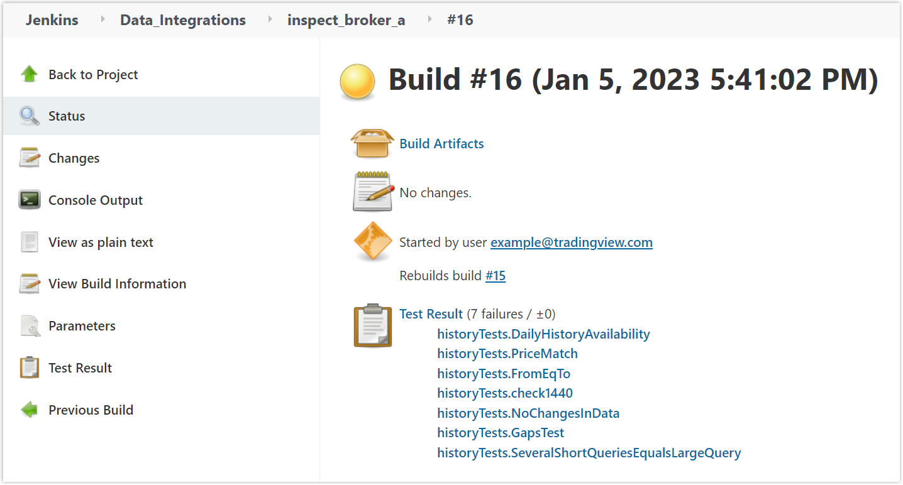

.. links
.. _`/authorize`: https://www.tradingview.com/rest-api-spec/#operation/authorize
.. _`/groups`: https://www.tradingview.com/rest-api-spec/#operation/getGroups
.. _`/history`: https://www.tradingview.com/rest-api-spec/#operation/getHistory
.. _`/streaming`: https://www.tradingview.com/rest-api-spec/#operation/streaming
.. _`/symbol_info`: https://www.tradingview.com/rest-api-spec/#operation/getSymbolInfo
.. _`Jenkins`: cu-jenkins.xtools.tv

Data integration tests
======================

.. contents:: :local:
  :depth: 1

After you implement API, contact the TradingView team.
They will prepare a test suite in Jenkins and provide you with credentials.
The tests help the broker ensure that the integration with the TradingView user interface works correctly.

Run tests
...........

1. Log into `Jenkins`_. You'll see the main page of your build plans.
2. Select *Data_Integrations → inspect_<project_name>* to open your project page.
3. Go to *Build with parameters* and select the parameters that correspond to the endpoints of your API. Here, you can select all endpoints at once or just one.

  .. image:: ../../images/DataTests_BuildWithParameters.png
      :alt: Build with parameters
      :align: center

4. Select *Build*.
5. Wait for the tests to complete. You can check the progress bar in *Build history*.
6. Select the latest build number to view `test results <#test-results>`__.

Test results
.............

On the project's page → *Build History*, you can see the list of latest builds.
Click on the last build number to see the results.

The build number can be highlighted in one of the following colors:

- Green indicates that all tests passed. In this case, contact the TradingView team for further instructions.
- Yellow or red indicates that there are issues in the tests that need to be fixed. Select a test in the *Test Result* list to view the issue description. It contains a link to a dump file with request contents and a link to the test description in the broker manual. Fix the issues and run the tests again.

When all tests are passed, contact the TradingView team for further instructions.
Usually, the process of delivering data to production takes 1−2 weeks after testing is completed.

.. Test types
.. ...........

.. Tests relate to the `/authorize`_, `/groups`_, `/symbol_info`_, `/history`_, and `/streaming`_ endpoints.
.. You can find detailed descriptions for each test.

.. Authorize tests
.. ----------------

.. +-------------------------------------+------------------------------------------------------+
.. | Test                                | Description                                          |
.. +=====================================+======================================================+
.. | :doc:`authBasicFieldsFormat`        | Checks that response fields match the specification. |
.. +-------------------------------------+------------------------------------------------------+
.. | :doc:`authBasicNewTokenPerRequest`  | Checks that each request returns a unique token.     |
.. +-------------------------------------+------------------------------------------------------+
.. | :doc:`authOAuth2FieldsFormat`       | Checks that response fields match the specification. |
.. +-------------------------------------+------------------------------------------------------+
.. | :doc:`authOAuth2NewTokenPerRequest` | Checks that each request returns a unique token.     |
.. +-------------------------------------+------------------------------------------------------+

.. Groups tests
.. -------------

.. +----------------------------------------+-----------------------------------------------------------------+
.. | Test                                   | Description                                                     |
.. +========================================+=================================================================+
.. | :doc:`groupsResponseFieldsCorrectness` | Checks that response fields match the specification.            |
.. +----------------------------------------+-----------------------------------------------------------------+
.. | :doc:`groupsUnauthorizedRequest`       | Checks for the 401 status code when requesting without a token. |
.. +----------------------------------------+-----------------------------------------------------------------+

.. History tests
.. --------------

.. +---------------------------------------------------+-------------------------------------------------------------------------------------------------------------------+
.. | Test                                              | Description                                                                                                       |
.. +===================================================+===================================================================================================================+
.. | :doc:`historyBeyondLeftBoundary`                  | Checks that ``no_data`` returns when requesting data beyond the left boundary.                                    |
.. +---------------------------------------------------+-------------------------------------------------------------------------------------------------------------------+
.. | :doc:`historyCheck1440`                           | Checks that 1440 bars are returned during a 24-hour day.                                                          |
.. +---------------------------------------------------+-------------------------------------------------------------------------------------------------------------------+
.. | :doc:`historyDailyHistoryAvailability`            | Checks if the daily history is available for symbols with ``has_daily=true`` and if the bar time is correct.      |
.. +---------------------------------------------------+-------------------------------------------------------------------------------------------------------------------+
.. | :doc:`historyFromEqTo`                            | Gets exactly one bar if ``from`` is equal ``to``.                                                                 |
.. +---------------------------------------------------+-------------------------------------------------------------------------------------------------------------------+
.. | :doc:`historyGapsTest`                            | Checks responses on gaps in historical data.                                                                      |
.. +---------------------------------------------------+-------------------------------------------------------------------------------------------------------------------+
.. | :doc:`historyNoChangesInData`                     | Checks that there are no data changes after the bar closes.                                                       |
.. +---------------------------------------------------+-------------------------------------------------------------------------------------------------------------------+
.. | :doc:`historyPriceMatch`                          | Checks that the price matches between daily data and minute data.                                                 |
.. +---------------------------------------------------+-------------------------------------------------------------------------------------------------------------------+
.. | :doc:`historySeveralShortQueriesEqualsLargeQuery` | Checks if the data received from multiple short requests is the same as the data received from one large request. |
.. +---------------------------------------------------+-------------------------------------------------------------------------------------------------------------------+
.. | :doc:`historyUnauthorizedRequest`                 | Checks for the 401 status code when requesting without a token.                                                   |
.. +---------------------------------------------------+-------------------------------------------------------------------------------------------------------------------+

.. Streaming tests
.. ----------------

.. +-------------------------------------------+--------------------------------------------------------------------------------------------------------+
.. | Test                                      | Description                                                                                            |
.. +===========================================+========================================================================================================+
.. | :doc:`streamingAskBidQuoteTradeExistence` | Checks that trades, asks, bids, and quotes appear for all symbols during an active session.            |
.. +-------------------------------------------+--------------------------------------------------------------------------------------------------------+
.. | :doc:`streamingDailyBarsUpdate`           | Checks that the daily bar is updated during a 24-hour day.                                             |
.. +-------------------------------------------+--------------------------------------------------------------------------------------------------------+
.. | :doc:`streamingHistoryEquality`           | Checks that the historical data matches the streaming data.                                            |
.. +-------------------------------------------+--------------------------------------------------------------------------------------------------------+
.. | :doc:`streamingNoDelays`                  | Checks that the tick time matches the current time (delays do not exceed the allowed limit).           |
.. +-------------------------------------------+--------------------------------------------------------------------------------------------------------+
.. | :doc:`streamingPermanentConnection`       | Checks that the connection is persistent.                                                              |
.. +-------------------------------------------+--------------------------------------------------------------------------------------------------------+
.. | :doc:`streamingSymbolsCheck`              | Checks that the symbol exists and that all symbols have ticks in symbol_info during an active session. |
.. +-------------------------------------------+--------------------------------------------------------------------------------------------------------+
.. | :doc:`streamingTimeGrow`                  | Checks that the tick time is not decreasing.                                                           |
.. +-------------------------------------------+--------------------------------------------------------------------------------------------------------+
.. | :doc:`streamingUnauthorizedRequest`       | Checks for the 401 status code when requesting without a token.                                        |
.. +-------------------------------------------+--------------------------------------------------------------------------------------------------------+

.. Symbol_info tests
.. ------------------

.. +-----------------------------------------+-----------------------------------------------------------------+
.. | Test                                    | Description                                                     |
.. +=========================================+=================================================================+
.. | :doc:`symbolsResponseFieldsCorrectness` | Checks that response fields match the specification.            |
.. +-----------------------------------------+-----------------------------------------------------------------+
.. | :doc:`symbolsUnauthorizedRequest`       | Checks for the 401 status code when requesting without a token. |
.. +-----------------------------------------+-----------------------------------------------------------------+
