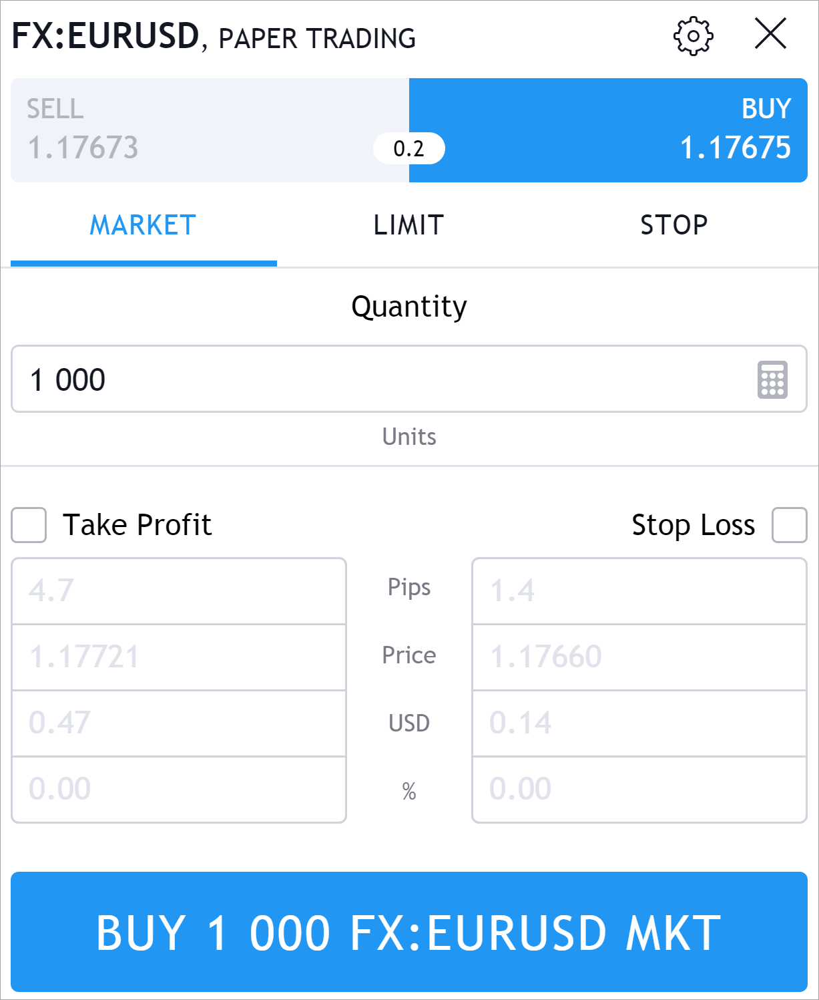
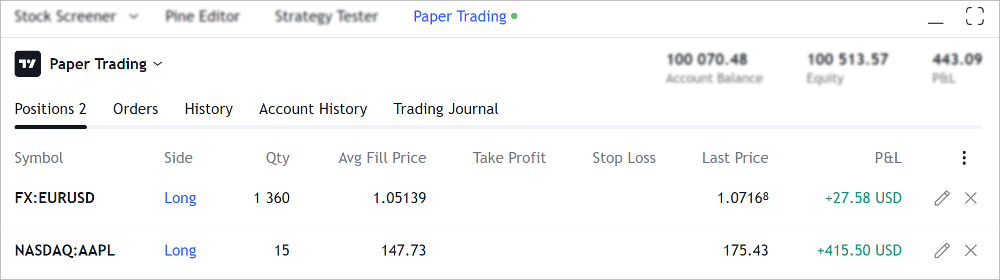

.. links
.. _`/accounts`: https://www.tradingview.com/rest-api-spec/#operation/getAccounts
.. _`/config`: https://www.tradingview.com/rest-api-spec/#operation/getConfiguration
.. _`/depth`: https://www.tradingview.com/rest-api-spec/#operation/getDepth
.. _`/state`: https://www.tradingview.com/rest-api-spec/#operation/getState
.. _`TradingView REST API`: https://www.tradingview.com/rest-api-spec

UI elements
-----------

.. contents:: :local:
   :depth: 1

Account Summary Row
...................
The *Account Summary Row* is a line that is always displayed after login into the integration. It contains the most 
important information about the current state of the sub-account currently selected by the user. 

By default, *Account Summary Row* displays the values of the `/state`_ request into three fields:

* ``balance`` into the *Account Balance*,
* ``unrealizedPL`` into the *Profit*,
* ``equity`` into the *Equity*.

.. code-block:: json

  {
    "s": "ok",
    "d": {
      "balance": 41757.91,
      "unrealizedPl": 1053.02,
      "equity": 42857.56,
    }
  }

But *Account Summary Row* allows to display other required broker information after configuration. You can configure it
at the broker or sub-account level. Setting at the broker level will allow displaying the same information for all
sub-accounts. Setting at the sub-account level allows you display information for the user-selected account. In this case,
the information it can be different for different sub-accounts.

.. code-block:: json

  {
    "s": "ok",
    "d": [
      "ui": {
        "accountSummaryRow": [
          {
            "id": "accountBalance",
            "title": "Account Balance"
          },
          {
            "id": "Equity",
            "title": "Realized P/L"
          },
          {
            "id": "Open Profit",
            "title": "Unrealized P/L"
          }
        ],
      },
    ]
  }

For custom configuration of the *Account Summary Row* follow the steps below.

#. Enable the ``supportCustomAccountSummaryRow`` flag in the `/accounts`_ request.
#. Configure the *Account Summary Row* fields in the `/config`_ request in the ``d`` → ``accountSummaryRow`` object if
   you need to configure it at the broker level.
#. Set up ``ui`` → ``accountSummaryRow`` object in the `/accounts`_ to configure the *Account Summary Row* fields at
   the account level. The account level setting has a higher priority and will be applied if there is a configuration at
   both levels.
#. Set up ``accountSummaryRowData`` object in the `/state`_ to configure the *Account Summary Row* fields.
#. In the `/state`_ request in the ``accountSummaryRowData`` object, send the values for *Account Summary Row*. 
   The order and size of the sent array must match the order and size of the array specified in the configuration.

If the display area of the *Account Summary Row* is undersized, the elements will be hidden sequentially, 
starting with the very first. This can happen on low-resolution screens. Therefore, arrange information in order of 
increasing importance.

Account Summary Tab
...................
The *Account Summary Tab* displays the fields received by `/state`_ request as a set of tables. Only one 
table is displayed, by default. It uses the fields ``balance``, ``unrealizedPL``, and ``equity`` (if sent, the field 
is optional).

The information displayed in the *Account Summary Tab* can be flexibly configured at the broker or sub-account level.
The settings made at the broker level will be displayed the same for all sub-accounts. Setting at the sub-account level 
will allow displaying information for the account selected by the user, and the information may be different for 
different sub-accounts.

* At the broker level, the ``accountManager`` object is returned in the `/config`_ request.
* At the account level, the ``accountManager`` object is returned in the `/accounts`_ request inside the ``ui`` object.

In both cases, it contains an array of table objects. The columns of the table are defined within each such array.

Regardless of the configuration level, values for the tables are returned in the `/state`_ query in the ``amData`` 
object. The ``amData`` object is an array of tables. It contains a nested array of strings with a nested array of 
columns as string values. This object must be the same size as the object defined in the configuration.

.. _trading-ui-orderticket:

Order Ticket
............

.. tip::
   
   Purchase behavior:

   * There is a :term:`Short Position` and we set a trailing stop to buy.
   * When the market price goes down, the :term:`Stop Order` price goes down as well.
   * But, if the market price rises, the :term:`Stop Order` price remains unchanged.
   * And in the end, if the market continues to grow and reaches the price set in the order, it will be executed.

   Selling behavior:

   * There is :term:`Long Position` and we set a trailing stop to sell.
   * When the market price rises, the :term:`Stop order` price rises as well.
   * But, if the market price goes down, the :term:`Stop order` price remains unchanged.
   * And if the market continues to fall and reaches the price  established in the order, it will be executed.

Durations
~~~~~~~~~
TradingView REST API allows you to configure the duration (or *Time In Force*) separately for each of the supported
order types. By default, any item from the duration list will be shown in the *Order Ticket* only for *Limit*, *Stop*,
*Stop-Limit* orders. If this list should be different from the default for any Durations elements, you must submit it
for this item in the ``supportedOrderTypes`` field. It must be an array of order types for which this duration will be
available.

.. Protect Position
.. ~~~~~~~~~~~~~~~~

.. Close Position
.. ~~~~~~~~~~~~~~

.. Reverse Position
.. ~~~~~~~~~~~~~~~~

.. _depth-of-market:

Depth Of Market
...............

*Depth of Market* or :term:`DOM` (also known as *Order Book*), is a window that shows how many open buy and sell orders
there are at different prices for a security. Let\'s say the current price is $1, the DOM will show how many orders
there are at $0.90, $1.10, etc. It\'s a great tool to see where the supply and demand levels are.

To enable :term:`DOM` in the TradingView UI follow the next steps:

* Set ``supportLevel2Data`` in the `/accounts`_ to ``true`` if you have :term:`Level 2 data`.
* Implement `/depth`_ endpoint.
* Set ``supportDOM`` to ``true`` if you want to enable DOM in the UI.

.. _trading-ui-accountmanager:

..
Account Manager
...............

*Account manager* is a panel on the bottom of the screen. This panel can have multiple tables. The *Account Manager* 
can be configured both at the broker configuration level and for each individual sub-account separately. You should use 
one of these options.

* At the broker level use `/config`_ → ``d`` → ``accountManager``.
* At the sub-account level use `/accounts`_ → ``d`` → ``ui`` → ``accountManager``.

But the data for the *Account manager* in any case is sent to `/state`_ → ``d`` → ``amData``

.. Orders table
.. ~~~~~~~~~~~~

.. Positions table
.. '''''''''''''''

.. Custom tabs
.. """""""""""

.. _trading-ui-chart:

.. Chart trading
.. .............
