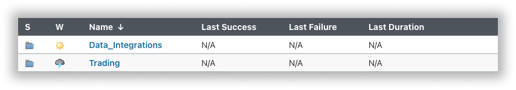

.. links
.. _`Jenkins`: https://cu-jenkins.xtools.tv
.. _`auto-test service`: https://cu-jenkins.xtools.tv
.. _`TradingView REST API`: https://www.tradingview.com/rest-api-spec/
.. _`Data_integrations section`: https://cu-jenkins.xtools.tv/job/Data_integration/
.. _`Trading section`: https://cu-jenkins.xtools.tv/job/Trading/
.. _`/authorize`: https://www.tradingview.com/rest-api-spec/#operation/authorize

Trading integration tests
=========================

.. contents:: :local:
   :depth: 1

Test stages
-----------
In general, trading integration testing is independent of the :doc:`data integration <../data/index>` (exceptions are 
:doc:`described separately <../trading/Mapping_symbols>`) and happens in several stages.

While preparing for implementation, the broker provides a list of features available to its platform users. Based on 
that list, we compile a set of test cases and pass them to the broker. These test cases help to make sure that the 
integration with the TradingView user interface works correctly.

We provide a special `auto-test service`_ for the `TradingView REST API`_. Please be aware that your API implementation 
needs to pass these tests successfully in order to be added to the :ref:`TradingView sandbox<hat-is-the-sandbox>`.

You can request access to the service if only even one part of the endpoints (either data or trading) is implemented. 
Below is a guide on how to use this service.

Test structure
--------------

We provide `Jenkins`_ for the automated testing of the trading and data integration endpoints implementation.

Use `Data_Integrations section`_ to test data integration, and `Trading section`_ for trading integration.

Each section contains a project with the broker's name on it.

There are two options for authorisation into the broker's API server. 

* The first option uses a login-password pair.
* The second option uses a token. You can use permanent token here. Or you can implement an `/authorize`_ endpoint 
  specifically for testing.

Select the desired option and then provide us with the credentials and API server address in order to use the 
`auto-test service`_.

Launching the tests
-------------------

* Go to your build plan (Jenkins → Trading → Broker_name) to run the test.
* Open the **Build with Parameters** section.
* Change the build parameters if necessary.
* Click the **Build** button.

The following parameters are used for the build:

* ``REST_API_URL`` --- your `TradingView REST API`_ implementation address;
* ``LOGIN``, ``PASSWORD`` --- data for ``REST_API_URL`` access with the login/password authorization;
* ``ACCESS_TOKEN`` --- token (in case token authorization is used).

The fields contain default data (pre-sent by the broker). The value of sensitive ``PASSWORD`` or ``ACCESS_TOKEN`` 
parameters can be masked. The values can be changed if required.

Results analysis
----------------

Go to the **Allure Report** section to view the test results. It is available in the panel on the left side and in the 
**Build History** below.

The **Categories** section shows information about failed tests. So, in the **Suites** section you can find the 
results of the failed and passed tests. 

In addition to the error message itself, pay attention to the following fields:

* **Request** --- API request body;
* **Response** --- response received;
* **Error** --- the results of comparison of the response received vs. expected response.

